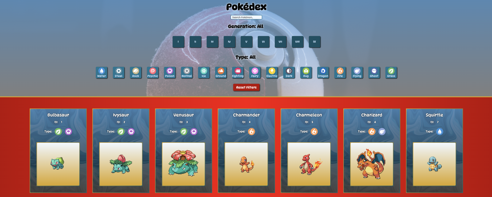

# School Project: Pokédex

## Description
Using the [The RESTful Pokémon API (PokeAPI)](https://pokeapi.co/) this project was built to resemble a tool similar to a "Pokédex", a device that holds a catalog and provide information regarding different species of Pokémon, featured in the popular anime series.

The approach taken was adapted to enable searches by name, and filtering by generation and species type through a delimited range of Pokémons. The Pokémons are displayed inside a card that includes ID and type information.

## Languages
- HTML
- CSS
- JavaScript

## Live Page

[Pokédex](https://public.bc.fi/s2300106/pokedex/)

## Instructions

The Pokédex by default displays a range that goes up to 908 Pokémons. 

1. To find a particulat Pokémon card you want to see, use the search field at the top of the page by typing the Pokémon's name. 

2. Once you start typying, you will start instantly seeing the Pokémons which names match what you type.

3. When you are ready to move on, you can clear the field with backspace or clicking the reset button.

4. To filter per generation, click the button that matches the generation of Pokémons you want to see.

5. To filter per type, click the button that matches the species type you want to see on screen.

6. If you click one category filter and then the other (e.g. generation first, and then type), you will see a Pokémon subset filtered by both.

If you click only one category filter and not the other, then no filtering is combined.

7. Play around with the different filter combinations.

8. Use the reset button to restart and clear the last filter applied.

## Credits

- Pokémon data from [The RESTful Pokémon API (PokeAPI)](https://pokeapi.co/)

- Pokémon type icons from [Bulbapedia](https://bulbapedia.bulbagarden.net/wiki/Type)

- Background picture from [Unsplash](https://unsplash.com/)

